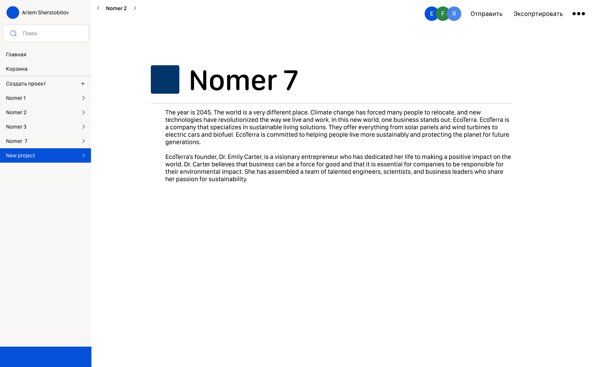
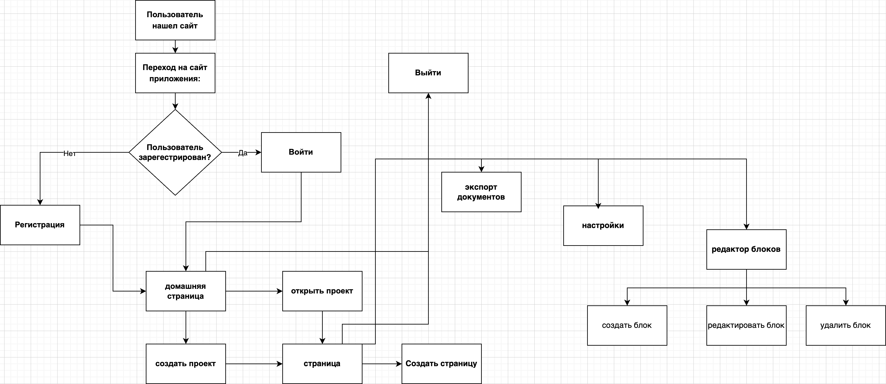
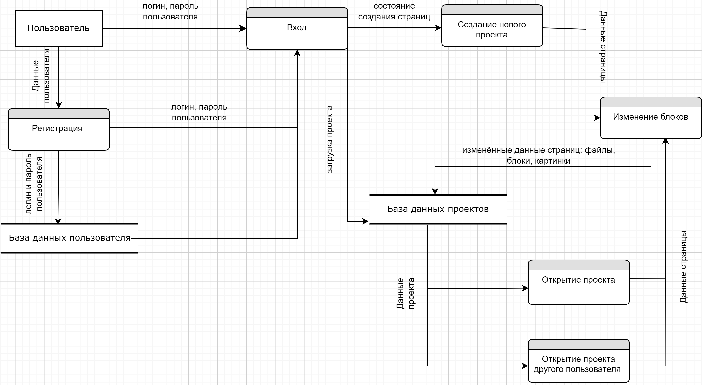
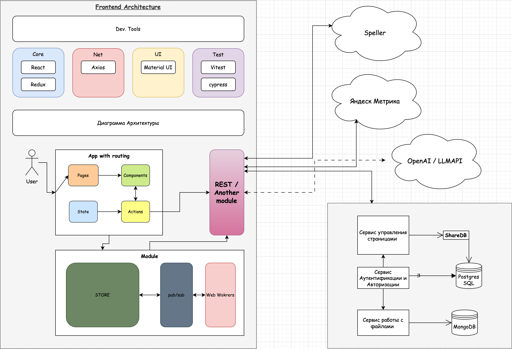
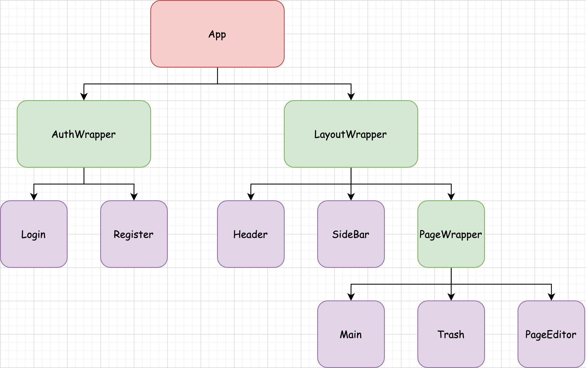

# **Textify (блочный редактор заметок/текста)**

**Textify** — это веб-приложение для создания настраиваемых заметок, где пользователи могут подключать различные компоненты и совместно работать над общими документами. Оно позволяет управлять заметками, подключать к ним других пользователей, а также предоставляет инструменты для редактирования текста, контроля версий и многое другое.

---

## **Содержание**
1. [Описание проекта](#описание-проекта)
2. [Функциональные возможности](#функциональные-возможности)
3. [Стек технологий](#стек-технологий)
4. [Архитектура](#архитектура)
5. [Установка и настройка](#установка-и-настройка)
6. [Тестирование](#тестирование)
7. [Спринты](#спринты)

---

## **Описание проекта**

Textify — это платформа для коллаборативного создания заметок с использованием блочного редактора, возможностью одновременной работы нескольких пользователей, а также системой контроля версий. Приложение предоставляет инструменты для проверки орфографии, обработки текста с помощью языковых моделей, и кастомизации внешнего вида заметок.

Проект использует **React** и **Redux** для frontend части и **Node.js** для backend.

---

## **Функциональные возможности**

### **Основные функции**:
- **Блочный текстовый редактор**: Позволяет структурировать заметки с помощью блоков, управляя макетом и контентом.
- **Совместное редактирование**: Несколько пользователей могут одновременно редактировать одну и ту же заметку в режиме реального времени.
- **Система контроля версий**: Позволяет отслеживать изменения и восстанавливать предыдущие версии заметок.

### **Дополнительные функции**:
- **Проверка орфографии**: Встроенная проверка орфографии с использованием Speller API.
- **Работа с языковыми моделями**: Поддержка OpenAI API для генерации текста и других AI-функций.
- **Кастомизация элементов**: Возможность изменять внешний вид заметок, включая изменение блоков и визуальных элементов.
- **Поиск и замена**: Инструменты для быстрого поиска и замены текста в заметках.
- **Макросы** *(планируется)*: Введение пользовательских макросов для автоматизации задач.

---

## **Стек технологий**

### **Frontend**:
- **[React](https://react.dev/)**: Библиотека для создания пользовательских интерфейсов.
- **[Redux](https://redux.js.org/)**: Управление состоянием приложения для предсказуемого изменения данных.

### **Backend**:
- **Node.js**: Среда выполнения JavaScript для работы на стороне сервера.

### **Система сборки**:
- **[Vite](https://vite.dev/)**: современная система сборки, которая активно набирает популярность среди разработчиков. Главное отличие Vite от других систем - это скорость сборки, он очень быстрый. Vite использует новые достижения в браузерной экосистеме: нативные ES модули (файлы с расширением .mjs). За счет этого, Vite во много раз быстрее собирает все модули в единую конструкцию.

### **Библиотеки и инструменты**:
- **[Axios](https://axios-http.com/ru/docs/api_intro)**: HTTP клиент для выполнения запросов к серверу.
  Он был выбран за его простоту и высокую популярность среди разработчиков. По ситуации думаем внедрить в проект позже React Query.
- **[Web Workers](https://developer.mozilla.org/en-US/docs/Web/API/Web_Workers_API/Using_web_workers)**: Асинхронные задачи в фоновом режиме, позволяющие выполнять сложные операции без заморозки интерфейса.
- **[Material UI](https://mui.com/material-ui/)**: Популярная библиотека компонентов для создания современного и адаптивного интерфейса.
  Мы выбрали эту библиотеку, потому что у нее очень хорошая документация, много дополнительных материалов в интернете, а также за счет того, что она популярно, в ней мало багов.

### **Фреймворки для тестирования**:
- **[Cypress](https://www.cypress.io/)**: Фреймворк для end-to-end тестирования.
  Был выбран для end-to-end тестирования благодаря своей простоте и широким возможностям для тестирования пользовательского интерфейса. Мы уже применяли данный инструмент в лабораторной по тестированию на ОПИ.
- **[Vitest](https://vitest.dev/)**: Фреймворк для модульного тестирования, оптимизированный для работы с Vite.
  Выбрали этот инструмент для тестирвовния, так как он оптимизрован с Vite, а также поддерживает весь необходимый функционал.

### **Сторонние сервисы**:
- **[Speller API](https://yandex.ru/dev/speller)**: Проверка орфографии с использованием Yandex Speller API.
- **[Yandex Metrika](https://yandex.ru/dev/metrika)**: Аналитика и отслеживание активности пользователей.

---

## **Архитектура**

## User Flow

## Диаграмма даных

## Общая архитектура

## Архитектура компонентов

---

## **Установка и настройка**

Coming soon...

---

## **Тестирование**

Coming soon...

---

## **Спринты**

| **Спринт**  | **Описание**                                                                                                           | **Тестирование**                               |
|-------------|-----------------------------------------------------------------------------------------------------------------------|------------------------------------------------|
| **Sprint 1**| Создание компонентов и базовая инфраструктура. | Юнит-тесты компонентов.       |
| **Sprint 2**| Написание основной бизнес логики.                                         | Юнит тестирование, интеграционные тесты.      |
| **Sprint 3**| Реализация основных страниц (PageEditor, Trash, Main)                                                      | Юнит тестирование, интеграционные тесты, e2e.       |
| **Sprint 3**| Реализация функционала login/register и интеграция с backend API.                                                      | Тестирование авторизации и API запросов, e2e.       |